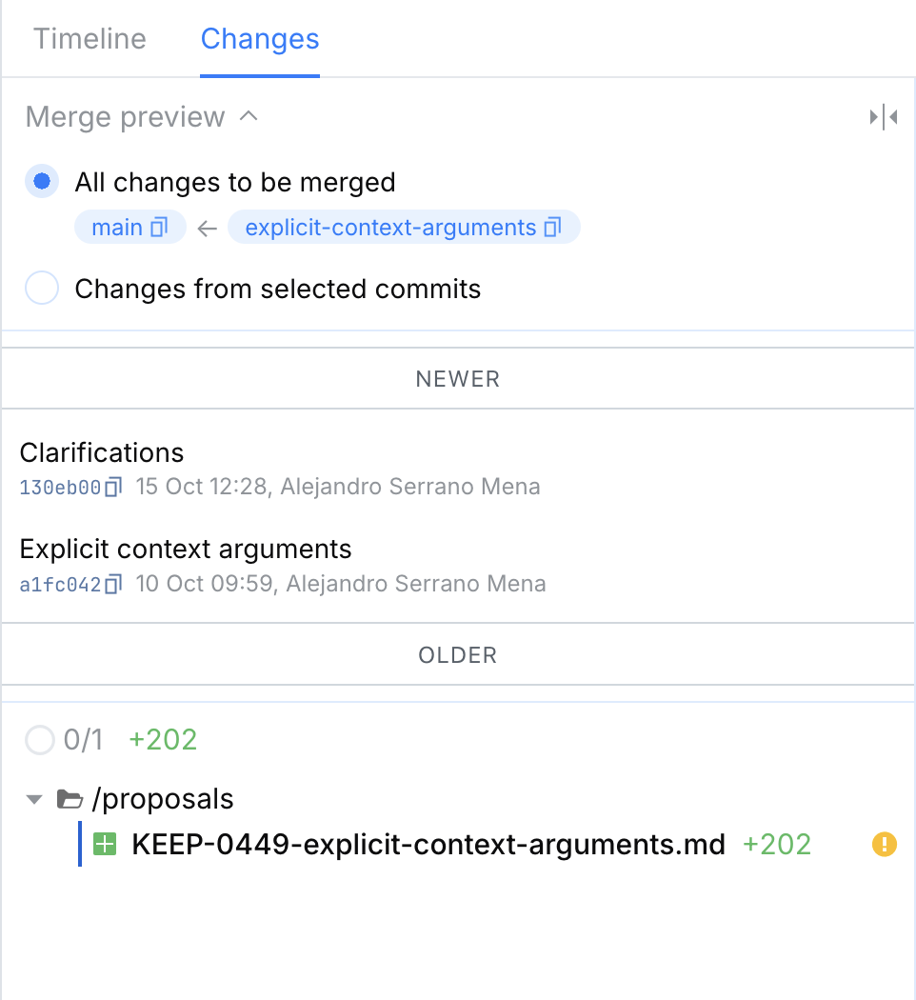
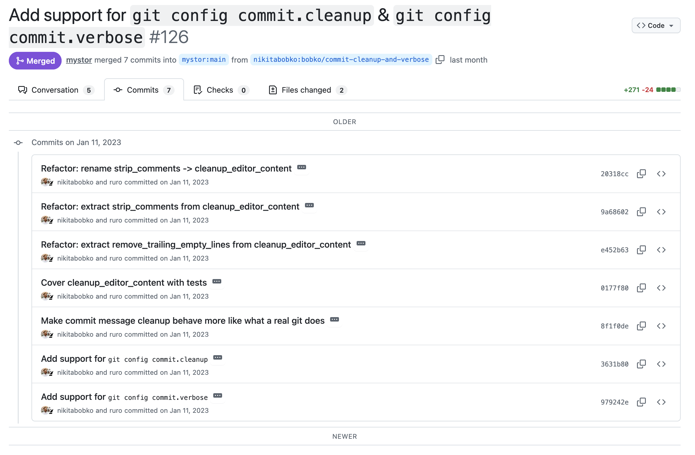

# Commit Newer/Older Indicators

A tiny browser extension that adds simple visual indicators to commit lists so you instantly know which side is newer and which is older.

- On GitHub Pull Request (https://github.com): places "Older" at the top and "Newer" at the bottom.
- On JetBrains Space Code Review (https://code.jetbrains.team/, https://jetbrains.team/): places "Newer" at the top and "Older" at the bottom.

## Installation

TODO. I am in the process of publishing the extension to stores

## Motivation

Because it's different every time on every web site and git CLI.

## Code quality

I don't care, vibe-coded with Junie

## Screenshots

### Space

### GitHub

